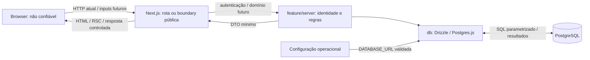

# Threat model e trust boundaries

Guardian Bay é um e-commerce de simulação. Este modelo reflete a revisão da Epic 2 e aplica as [decisões arquiteturais aprovadas](README.md#decisões-arquiteturais-essenciais), sem antecipar funcionalidades de domínio.

## Escopo e estado atual

Hoje existem páginas Server do scaffold, assets públicos, baseline HTTP, configuração privada validada e infraestrutura lazy PostgreSQL/Drizzle protegida por `server-only`. Há schemas/migrations `users`, `sessions` e `login_rate_limits`, [credenciais](README.md#identidade-e-credenciais-ecmsg-23) e [autenticação/sessões server-side](README.md#autenticação-e-sessões-ecmsg-24), com Actions de login/logout, cookie HttpOnly e leitura mínima da identidade. Integração usa PostgreSQL real isolado. O scaffold não consome essas Actions ou DB; não há UI de login, Client Components próprios, Route Handlers, cadastro público ou operações comerciais.

Os fluxos de conta, catálogo, carrinho, pedido e pagamento simulado abaixo são previstos pela arquitetura, não funcionalidades implementadas. Não há integração financeira real. Bibliotecas citadas na stack que ainda não constam de `package.json` não são controles existentes. Deployment, domínio, terminação TLS e permissões reais de banco ainda não estão definidos; precisam de revisão quando houver ambiente concreto.

## Atores e ativos

| Ator | Capacidade e confiança |
| --- | --- |
| Visitante | Acessa a superfície HTTP atual; controla requests, URLs, headers e seu browser |
| Usuário autenticado | Identidade resolvida por sessão server-side; autenticação não torna seus inputs confiáveis nem autoriza recursos de outro usuário |
| Atacante anônimo ou autenticado | Pode chamar entradas diretamente, trocar IDs/valores, repetir ou paralelizar requests e automatizar operações |
| Site externo malicioso | Pode induzir navegação ou requests do browser da vítima; relevante para XSS/CSRF quando houver conteúdo externo ou sessão |
| Desenvolvedor/operador | Controla código, dependências, configuração e CLI com privilégios operacionais; esses acessos não são concedidos ao browser. Papéis administrativos da aplicação ainda não estão definidos |

Ativos atuais: integridade do código/configuração e dos artefatos de build, credenciais de conexão quando configuradas, identidade/e-mail, hashes de senha, tokens/sessões e disponibilidade do servidor/pool. Ativos dos futuros fluxos: demais dados pessoais, carrinhos/pedidos, preços/descontos, estoque, totais e estado do pagamento simulado. Logs e respostas devem preservar a confidencialidade desses ativos.

## Superfícies e fluxos

Entradas atuais: requests HTTP da página, assets e superfície do framework; contratos das Actions de login/logout/leitura autorizada ainda sem consumidor no scaffold; variáveis de ambiente/arquivos privados e configuração fornecida à CLI Drizzle. Instalação depende de pacotes externos e o build baixa fontes. Entradas futuras de domínio: formulários, argumentos de Actions e bodies de handlers necessários, incluindo IDs e quantidades conforme a operação real.

`params`, `searchParams`, JSON, `FormData`, headers, cookies, hidden inputs, `.bind()`, localStorage e estado de UI são não confiáveis. Um token/cookie só fornece identidade após verificação server-side. Dados persistidos originados do cliente continuam não confiáveis para renderização e regras, mesmo após uma query válida.

O diagrama inclui persistência de autenticação/sessão e operações futuras de domínio. A página atual apenas renderiza o scaffold e a CLI carrega sua configuração sem passar por uma feature. Leituras server de identidade seguem `Server Component → feature/server → db`; login, logout e leitura autorizada por Action seguem `Client → Action → feature/server → db` quando consumidos. Render não executa mutations.

## Trust boundaries e autoridade

| Boundary / estado | O que atravessa e lado não confiável | Validação e autenticação/autorização exigidas nos consumidores | Autoridade e responsabilidade |
| --- | --- | --- | --- |
| Browser → Next.js — existente | URL, método, headers, cookies e, quando houver consumidor, payload; todo input externo é não confiável | A entrada server deve validar formato, tamanho e campos permitidos quando houver consumidor. Identidade e permissões são exigidas conforme o recurso/operação, não para todo asset público | Servidor define o acesso e os valores críticos; frontend fornece apenas intenção e feedback de UX |
| Client → Action — login, logout e leitura autorizada implementados, sem consumidor no scaffold; Route Handler futuro | Argumentos/body e IDs, inclusive valores recebidos em props ou `.bind()`; caller é não confiável | Validação server-side: login valida contrato/credencial e origem; logout valida origem e revoga o token apresentado; leitura autorizada valida input/origem e exige autenticação, ownership e sessão válida na query. Operações de domínio futuras verificam sessão, autorização, ownership e estado atual na execução | `feature/server` resolve identidade/sessão; nas operações de domínio decide valores críticos. Página/Proxy/UI não concedem autoridade |
| Next.js/CLI → PostgreSQL — identidade/sessão implementadas | Credencial de conexão, queries e resultados cruzam processos; SQL pode carregar valores originados do cliente | Queries de autenticação/sessão parametrizadas, constraints/FK e rotação em transaction. Operações de domínio futuras autorizam acesso a dados protegidos | Feature decide regras/DTO; `db` executa persistência; PostgreSQL preserva integridade configurada, sem inferir ownership do usuário a partir da credencial compartilhada |
| Servidor → browser — existente; DTOs de domínio futuros | HTML/RSC, props, assets, retornos e cookie de sessão | Feature projeta DTO mínimo; token bruto é entregue somente pelo Set-Cookie protegido, não pelo retorno da Action. Conteúdo externo exige tratamento adequado ao contexto de renderização | Hashes, registro interno de sessão, entidades completas e erros brutos não saem. Dados devolvidos e reenviados pelo browser voltam a ser input não confiável |
| Ambiente/ferramentas externas → servidor, CLI e build — existente | `DATABASE_URL`, pacotes e fontes; privilégio operacional não equivale a dados seguros por origem | Infraestrutura valida configuração antes do uso; instalação usa lockfile e dependências exigem revisão. Origem, acesso a secrets e segurança do transporte são responsabilidades operacionais | Browser não seleciona credenciais/destino do DB. Build/CLI possuem privilégios próprios; produção exige isolamento e revisão de acesso/transporte |

`app → feature/server → db` também é um limite arquitetural interno, não uma autenticação entre processos. `server-only` protege imports client, mas não autoriza uma chamada. A CLI é uma entrada operacional privilegiada separada dos endpoints e deve usar o banco correto; não depende de autorização da UI.

## Ameaças prioritárias

Usamos [STRIDE](https://learn.microsoft.com/en-us/azure/security/develop/threat-modeling-tool-threats) como classificação: **S** identidade falsa, **T** adulteração, **R** repúdio, **I** exposição de informação, **D** indisponibilidade e **E** elevação de privilégio. A classificação abaixo vale para o escopo atual; controles parciais não equivalem a eliminação da ameaça. Superfícies futuras devem ser reavaliadas quando implementadas.

| Ameaça / STRIDE | Estado | Controle e risco residual |
| --- | --- | --- |
| Sessão/autenticação — S/E | Parcialmente mitigada | Argon2id, contratos distintos, hash sintético para usuário ausente, token aleatório, hash persistido, rotação, idle/limite absoluto e revogação reais. Cookie HttpOnly/Secure em produção. Token roubado continua bearer; não há MFA ou garantia de tempo constante absoluto |
| Autorização/IDOR/BOLA — E/I/T | Mitigada no recurso atual | Deny by default, identidade mínima e ownership/sessão na query da própria identidade; PostgreSQL testa A→A, A→B e revogação entre checks. Recursos comerciais precisam de autorização própria |
| Valores críticos — T | Não aplicável atualmente | Não há preço/estoque/pagamento/pedido implementado; autoridade futura permanece no servidor |
| Entrada maliciosa — T/D | Mitigada nas Actions atuais | Schemas strict com limites e argumentos extras rejeitados antes de custo; body de 16 KiB testado no transporte real. Tamanho/taxa do tráfego geral exige entrada confiável |
| XSS/browser — T/I/E | Parcialmente mitigada | Não há HTML/URL de usuário ou sink próprio inseguro; React escapa conteúdo. CSP bloqueia objetos/frames/mídia/workers e restringe imagens/fontes, mas não scripts/styles. Teste Chromium verifica runtime e bloqueios reais; Trusted Types não está habilitado |
| CSRF — S/T | Mitigada nas Actions atuais | POST nativo, Origin/Host explícito, HTTPS Origin em produção e SameSite=Lax; forwarded não concede autoridade. Requests cross-origin/sem Origin são rejeitados. Novos handlers exigem análise própria; CORS não autoriza mutations |
| SQL Injection — T/I/E | Mitigada no código atual | Queries Drizzle e tags sql/Postgres.js parametrizadas; sem sql.raw ou identificadores fornecidos pelo cliente. Scanner triado manualmente, com constraints e queries reais |
| Exposição de informação — I | Mitigada nas saídas atuais | DTO explícito id/email, hash/token fora do retorno, erros genéricos e logger allowlist; leitura privada não é cached e testes HTTP/DB conferem isolamento. Logs de terceiros exigem revisão operacional |
| Abuso, brute force, credential stuffing e DoS — D/S | Parcialmente mitigada | Budgets atômicos por identificador/global e dois slots protegem Argon2; expiração não bloqueia conta permanentemente. Sem IP confiável, atacante pode esgotar budget global. Proteção volumétrica/de origem depende do contrato de entrada ECMSG-27 antes de exposição pública |
| Concorrência/replay — T/D | Mitigada nas operações atuais | Reservas/slots atômicos; login rotaciona, logout idempotente revoga no servidor e replay revogado não autentica. Query protegida revalida sessão/ownership. Concorrência comercial não é aplicável atualmente |
| Repúdio — R | Parcialmente mitigada | Eventos de limiar e falha operacional server-only por allowlist e correlação aleatória, sink best effort; não há entrega durável, auditoria de domínio ou coleta/retenção configurada |
| Configuração/build/transporte — S/T/I | Parcialmente mitigada; deployment pendente | Secrets server-only, template vazio, lockfile e migrations revisados; produção não definida. Quatro advisories moderados de tooling dev e peer opcional foram triados na revisão; HTTPS/TLS/privilégios/coletor precisam de validação operacional |

## Controles atuais e candidatos da Epic 2

Controles observáveis: guards `server-only` em DB/configuração/credenciais/sessão/autorização, Argon2id e contratos distintos de criação/login, resposta equivalente e hash sintético para falhas de login, sessão revogável com expiração absoluta/idle, cookie HttpOnly/Secure em produção e validação de Origin/Host nas Actions; leitura da própria identidade com deny by default e ownership/sessão revalidados na query; body de Actions limitado a 16 KiB, reservas atômicas globais/por identificador e dois slots de hashing compartilhados, com eventos mínimos sem secrets; configuração privada validada, pool lazy, `.env*` ignorado com exceção do template, CSP incremental e gates de lint/tipos/unitários/build, integração PostgreSQL isolada e suíte HTTP/Chromium de segurança. Eles não demonstram segurança dos fluxos comerciais ainda ausentes. Consulte [requests/abuso](README.md#boundaries-e-requests-ecmsg-26), [autenticação](README.md#autenticação-e-sessões-ecmsg-24), [autorização](README.md#autorização-server-side-ecmsg-25), [erros](README.md#tratamento-de-erros-e-observabilidade-ecmsg-17) e [testes](README.md#testes-ecmsg-19) para os limites.

Candidatos para próximas Tasks, vinculados às ameaças acima:

- Autenticação e sessão: revisar a política de rotação, CSRF e limites de abuso ao introduzir novas mutations ou mudança de privilégio.
- Autorização e ownership: aplicar o [padrão implementado na identidade](README.md#autorização-server-side-ecmsg-25) às futuras operações comerciais, com permissão/ownership por operação e testes IDOR/BOLA.
- Contratos de entrada/saída e conteúdo: validação, DTOs, erros/logs/cache seguro e tratamento de XSS; avaliar CSP mais restritiva nas páginas reais.
- Proteção contra abuso: [limites de login/requests implementados](README.md#boundaries-e-requests-ecmsg-26); definir origem/IP confiável e proteção de entrada no deployment antes da exposição pública, preservando o budget de hashing compartilhado.
- Integridade comercial: cálculo monetário server-side, constraints, transactions, concorrência e idempotência com a primeira operação persistida.
- Operação segura: revisar acesso a configuração/dependências, transporte HTTPS/TLS e privilégios do DB/CLI quando houver deployment; configurar coleta/retenção dos eventos mínimos já implementados e revisar os findings de tooling registrados na [revisão da Epic 2](README.md#revisão-da-epic-2-ecmsg-31).

Essas pendências não atribuem IDs nem autorizam implementação antecipada. Reavalie o modelo quando surgir sessão, tabela, entrada pública ou integração externa, registrando sua boundary, autoridade, ameaça e evidência de mitigação. [Security-review](../../.agents/skills/security-review/SKILL.md) faz a revisão contextual; scanners são complementares.
