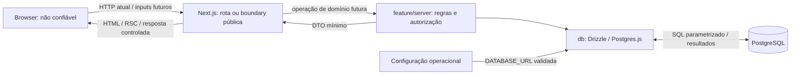

# Threat model e trust boundaries

Guardian Bay é um e-commerce de simulação. Este modelo orienta a Epic 2 e aplica as [decisões arquiteturais aprovadas](README.md#decisões-arquiteturais-essenciais), sem implementar controles ou definir novas camadas.

## Escopo e estado atual

Hoje existem páginas Server do scaffold, assets públicos, baseline HTTP, configuração privada validada e infraestrutura lazy PostgreSQL/Drizzle protegida por `server-only`. Nenhuma rota consome o banco. Não existem autenticação/sessão, Client Components próprios, Actions, Route Handlers, tabelas ou operações comerciais. Os testes atuais verificam somente a validação de `DATABASE_URL`.

Os fluxos de conta, catálogo, carrinho, pedido e pagamento simulado abaixo são previstos pela arquitetura, não funcionalidades implementadas. Não há integração financeira real. Bibliotecas citadas na stack que ainda não constam de `package.json` não são controles existentes. Deployment, domínio, terminação TLS e permissões reais de banco ainda não estão definidos; precisam de revisão quando houver ambiente concreto.

## Atores e ativos

| Ator | Capacidade e confiança |
| --- | --- |
| Visitante | Acessa a superfície HTTP atual; controla requests, URLs, headers e seu browser |
| Usuário autenticado futuro | Poderá operar recursos permitidos; autenticação não torna seus inputs confiáveis nem autoriza recursos de outro usuário |
| Atacante anônimo ou autenticado | Pode chamar entradas diretamente, trocar IDs/valores, repetir ou paralelizar requests e automatizar operações |
| Site externo malicioso | Pode induzir navegação ou requests do browser da vítima; relevante para XSS/CSRF quando houver conteúdo externo ou sessão |
| Desenvolvedor/operador | Controla código, dependências, configuração e CLI com privilégios operacionais; esses acessos não são concedidos ao browser. Papéis administrativos da aplicação ainda não estão definidos |

Ativos atuais: integridade do código/configuração e dos artefatos de build, credenciais de `DATABASE_URL` quando configuradas, disponibilidade do servidor e do pool quando usado. Ativos dos futuros fluxos: identidade/sessão, dados pessoais, carrinhos/pedidos, preços/descontos, estoque, totais e estado do pagamento simulado. Logs e respostas devem preservar a confidencialidade desses ativos.

## Superfícies e fluxos

Entradas atuais: requests HTTP da página, assets e superfície do framework; variáveis de ambiente/arquivos privados; configuração fornecida à CLI Drizzle. Instalação depende de pacotes externos e o build baixa fontes. Entradas futuras: formulários, argumentos de Actions e bodies de handlers necessários, incluindo IDs, quantidades e credenciais conforme a operação real.

`params`, `searchParams`, JSON, `FormData`, headers, cookies, hidden inputs, `.bind()`, localStorage e estado de UI são não confiáveis. Um token/cookie só fornece identidade após verificação server-side. Dados persistidos originados do cliente continuam não confiáveis para renderização e regras, mesmo após uma query válida.

O diagrama inclui o fluxo futuro de persistência. No código atual, a página apenas renderiza o scaffold e a CLI carrega sua configuração sem passar por uma feature. Uma leitura futura segue `Server Component → feature/server → db`; uma escrita segue `Client → Action/handler necessário → feature/server → db`. Render não executa mutations.

## Trust boundaries e autoridade

| Boundary / estado | O que atravessa e lado não confiável | Validação e autenticação/autorização exigidas nos consumidores | Autoridade e responsabilidade |
| --- | --- | --- | --- |
| Browser → Next.js — existente | URL, método, headers, cookies e, quando houver consumidor, payload; todo input externo é não confiável | A entrada server deve validar formato, tamanho e campos permitidos quando houver consumidor. Identidade e permissões são exigidas conforme o recurso/operação, não para todo asset público | Servidor define o acesso e os valores críticos; frontend fornece apenas intenção e feedback de UX |
| Client Component → Action/Route Handler — futuro, dentro da boundary HTTP acima | Argumentos/body e IDs, inclusive valores recebidos em props ou `.bind()`; caller é não confiável | Action/handler é endpoint público. Em cada execução sensível, valida input e verifica sessão, autorização, ownership e estado atual, podendo delegar checks a `feature/server` antes do efeito protegido | `feature/server` decide preço, desconto, estoque, total, permissões, ownership e status de pagamento. Página/Proxy/UI não concedem autoridade |
| Next.js/CLI → PostgreSQL — infraestrutura existente, sem queries de domínio | Credencial de conexão, queries e resultados cruzam processos; SQL pode carregar valores originados do cliente | Aplicação autentica a conexão; operação server autoriza o usuário antes de acessar dados protegidos. Queries parametrizadas e identificadores permitidos; DB aplica constraints/transactions conforme o schema real | Feature decide regras/DTO; `db` executa persistência; PostgreSQL preserva integridade configurada, sem inferir ownership do usuário a partir da credencial compartilhada |
| Servidor → browser — existente; DTOs de domínio futuros | HTML/RSC, props, assets e retornos deixam o ambiente privilegiado e tornam-se acessíveis ao cliente | Feature projeta DTO mínimo após autorização; boundary produz resposta segura. Conteúdo externo exige tratamento adequado ao contexto de renderização | Secrets, sessão interna, entidades completas e erros brutos não saem. Dados devolvidos e reenviados pelo browser voltam a ser input não confiável |
| Ambiente/ferramentas externas → servidor, CLI e build — existente | `DATABASE_URL`, pacotes e fontes; privilégio operacional não equivale a dados seguros por origem | Infraestrutura valida configuração antes do uso; instalação usa lockfile e dependências exigem revisão. Origem, acesso a secrets e segurança do transporte são responsabilidades operacionais | Browser não seleciona credenciais/destino do DB. Build/CLI possuem privilégios próprios; produção exige isolamento e revisão de acesso/transporte |

`app → feature/server → db` também é um limite arquitetural interno, não uma autenticação entre processos. `server-only` protege imports client, mas não autoriza uma chamada. A CLI é uma entrada operacional privilegiada separada dos endpoints e deve usar o banco correto; não depende de autorização da UI.

## Ameaças prioritárias

Usamos [STRIDE](https://learn.microsoft.com/en-us/azure/security/develop/threat-modeling-tool-threats) como classificação: **S** identidade falsa, **T** adulteração, **R** repúdio, **I** exposição de informação, **D** indisponibilidade e **E** elevação de privilégio. A tabela é análise de riscos das superfícies acima, não lista de vulnerabilidades demonstradas. Mitigações futuras são candidatas, não controles já implementados.

| Ameaça / STRIDE | Cenário e impacto | Controle esperado e evidência a exigir |
| --- | --- | --- |
| Sessão/autenticação — S/E | Forjar, fixar, roubar ou reutilizar sessão permite agir como outro usuário | Verificação server-side, ciclo de vida/revogação de sessão, proteção de cookies e testes de sessão ausente/inválida/expirada; ainda não existe sessão |
| Autorização/IDOR/BOLA — E/I/T | Usuário A troca um ID para ler/alterar pedido de B ou envia um papel privilegiado | Permissão e ownership na operação e em cada query/mutation protegida; testes A × B e de acesso privilegiado, sem confiar na página |
| Valores críticos — T | Alterar preço, desconto, estoque, total ou status de pagamento produz pedido inconsistente | Cliente envia ID + intenção; servidor consulta fontes confiáveis, calcula valores monetários e valida transições. Testar payload adulterado |
| Entrada maliciosa — T/D | Quantidade negativa, tipo/campo inesperado ou payload excessivo viola regras ou consome recursos | Validação server-side de contrato, limites e campos aceitos junto da boundary, seguida de regras de domínio; rejeições seguras |
| XSS — T/I/E | Conteúdo externo refletido/persistido ou URL perigosa executa código no browser e permite ações indevidas | Render seguro por contexto, validação de URLs e sanitização somente quando conteúdo rico exigir. Testar a superfície real; CSP atual é parcial e não restringe scripts/styles |
| CSRF — S/T | Site externo induz mutation com cookies da vítima | Estratégia por Action/handler e sessão: verificar proteções Origin/Host do framework, SameSite e necessidade de token. Testar origem indevida; CORS não substitui proteção CSRF |
| SQL Injection — T/I/E | Interpolar filtro/ID/ordenação em SQL permite leitura ou alteração indevida | Drizzle parametrizado, allowlist de identificadores dinâmicos e revisão de SQL bruto; testes com PostgreSQL real quando existir query |
| Exposição de informação — I | DTO, erro, log ou cache compartilhado revela credencial, sessão ou dados de outro usuário | Projeção mínima, erro público controlado, logging por allowlist e cache adequado a dados privados; testar isolamento e ausência de detalhes internos |
| Abuso de endpoints/Actions — D/S | Brute force, enumeração, automação ou requests repetidos esgotam recursos do servidor/DB | Limites por operação e identidade/origem adequada, custo/tamanho limitado e proteção contra abuso; validar com endpoint real sem tratar rate limit como autorização |
| Concorrência/replay — T/D | Duas compras do último item ou retry de pedido/pagamento duplicam efeitos | Transactions, constraints e estratégia de concorrência/idempotência por operação; testes simultâneos no DB real, sem confiar no estado de UI |
| Repúdio — R | Sem registro seguro, alteração sensível não pode ser investigada | Eventos server contextualizados com identidade verificada e correlação quando necessário, acesso/retenção definidos e sem secrets/PII desnecessários; logging ainda não implementado |
| Configuração/build/transporte — S/T/I | Credencial exposta, dependência adulterada ou conexão interceptada compromete execução/dados | Preservar secrets server-side e lockfile; revisar dependências, privilégios de CLI/DB e HTTPS/TLS no ambiente real. Não há deployment ou transporte de produção validado |

## Controles atuais e candidatos da Epic 2

Controles observáveis: guards `server-only` em DB/configuração, validação pura de `DATABASE_URL` sem expor valor/cause, configuração lazy do pool, `.env*` ignorado com exceção do template, baseline HTTP e gates de lint/tipos/unitários/build. Eles não demonstram segurança dos fluxos comerciais ainda ausentes. Consulte [erros e observabilidade](README.md#tratamento-de-erros-e-observabilidade-ecmsg-17), [baseline HTTP](README.md#baseline-de-segurança-http-ecmsg-18) e [testes](README.md#testes-ecmsg-19) para os limites já aprovados.

Candidatos para próximas Tasks, vinculados às ameaças acima:

- Autenticação e sessão: definir identidade server-side, ciclo de vida e cookies; relacionar a estratégia CSRF às primeiras mutations.
- Autorização e ownership: definir permissões por recurso/operação e cenários IDOR/BOLA quando houver domínio protegido.
- Contratos de entrada/saída e conteúdo: validação, DTOs, erros/logs/cache seguro e tratamento de XSS; avaliar CSP mais restritiva nas páginas reais.
- Proteção contra abuso: limites e resposta à automação/brute force nas entradas concretas.
- Integridade comercial: cálculo monetário server-side, constraints, transactions, concorrência e idempotência com a primeira operação persistida.
- Operação segura: revisar acesso a configuração/dependências, transporte HTTPS/TLS e privilégios do DB/CLI quando houver deployment; definir observabilidade mínima nas operações sensíveis.

Esses candidatos não atribuem IDs nem autorizam implementação antecipada. Reavalie o modelo quando surgir sessão, tabela, entrada pública ou integração externa, registrando sua boundary, autoridade, ameaça e evidência de mitigação. [Security-review](../../.agents/skills/security-review/SKILL.md) faz a revisão contextual; scanners são complementares.
