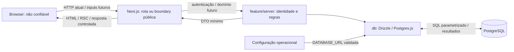

# Threat model e trust boundaries

Guardian Bay é um e-commerce de simulação. Este modelo orienta a Epic 2 e aplica as [decisões arquiteturais aprovadas](README.md#decisões-arquiteturais-essenciais), sem implementar controles ou definir novas camadas.

## Escopo e estado atual

Hoje existem páginas Server do scaffold, assets públicos, baseline HTTP, configuração privada validada e infraestrutura lazy PostgreSQL/Drizzle protegida por `server-only`. Há schemas/migrations `users` e `sessions`, [credenciais](README.md#identidade-e-credenciais-ecmsg-23) e [autenticação/sessões server-side](README.md#autenticação-e-sessões-ecmsg-24), com Actions de login/logout, cookie HttpOnly e leitura mínima da identidade. Integração usa PostgreSQL real isolado. O scaffold não consome essas Actions ou DB; não há UI de login, Client Components próprios, Route Handlers, cadastro público ou operações comerciais.

Os fluxos de conta, catálogo, carrinho, pedido e pagamento simulado abaixo são previstos pela arquitetura, não funcionalidades implementadas. Não há integração financeira real. Bibliotecas citadas na stack que ainda não constam de `package.json` não são controles existentes. Deployment, domínio, terminação TLS e permissões reais de banco ainda não estão definidos; precisam de revisão quando houver ambiente concreto.

## Atores e ativos

| Ator | Capacidade e confiança |
| --- | --- |
| Visitante | Acessa a superfície HTTP atual; controla requests, URLs, headers e seu browser |
| Usuário autenticado | Identidade resolvida por sessão server-side; autenticação não torna seus inputs confiáveis nem autoriza recursos de outro usuário |
| Atacante anônimo ou autenticado | Pode chamar entradas diretamente, trocar IDs/valores, repetir ou paralelizar requests e automatizar operações |
| Site externo malicioso | Pode induzir navegação ou requests do browser da vítima; relevante para XSS/CSRF quando houver conteúdo externo ou sessão |
| Desenvolvedor/operador | Controla código, dependências, configuração e CLI com privilégios operacionais; esses acessos não são concedidos ao browser. Papéis administrativos da aplicação ainda não estão definidos |

Ativos atuais: integridade do código/configuração e dos artefatos de build, credenciais de conexão quando configuradas, identidade/e-mail, hashes de senha, tokens/sessões e disponibilidade do servidor/pool. Ativos dos futuros fluxos: demais dados pessoais, carrinhos/pedidos, preços/descontos, estoque, totais e estado do pagamento simulado. Logs e respostas devem preservar a confidencialidade desses ativos.

## Superfícies e fluxos

Entradas atuais: requests HTTP da página, assets e superfície do framework; contratos das Actions de login/logout ainda sem consumidor no scaffold; variáveis de ambiente/arquivos privados e configuração fornecida à CLI Drizzle. Instalação depende de pacotes externos e o build baixa fontes. Entradas futuras de domínio: formulários, argumentos de Actions e bodies de handlers necessários, incluindo IDs e quantidades conforme a operação real.

`params`, `searchParams`, JSON, `FormData`, headers, cookies, hidden inputs, `.bind()`, localStorage e estado de UI são não confiáveis. Um token/cookie só fornece identidade após verificação server-side. Dados persistidos originados do cliente continuam não confiáveis para renderização e regras, mesmo após uma query válida.

O diagrama inclui persistência de autenticação/sessão e operações futuras de domínio. A página atual apenas renderiza o scaffold e a CLI carrega sua configuração sem passar por uma feature. A leitura de identidade segue `Server Component → feature/server → db`; login/logout seguem `Client → Action → feature/server → db` quando consumidos. Render não executa mutations.

## Trust boundaries e autoridade

| Boundary / estado | O que atravessa e lado não confiável | Validação e autenticação/autorização exigidas nos consumidores | Autoridade e responsabilidade |
| --- | --- | --- | --- |
| Browser → Next.js — existente | URL, método, headers, cookies e, quando houver consumidor, payload; todo input externo é não confiável | A entrada server deve validar formato, tamanho e campos permitidos quando houver consumidor. Identidade e permissões são exigidas conforme o recurso/operação, não para todo asset público | Servidor define o acesso e os valores críticos; frontend fornece apenas intenção e feedback de UX |
| Client → Action — login/logout implementados, sem consumidor no scaffold; Route Handler futuro | Argumentos/body e IDs, inclusive valores recebidos em props ou `.bind()`; caller é não confiável | Login valida contrato/credencial e origem; logout valida origem e revoga o token apresentado. Operações de domínio futuras verificam sessão, autorização, ownership e estado atual na execução | `feature/server` resolve identidade/sessão; nas operações de domínio decide valores críticos. Página/Proxy/UI não concedem autoridade |
| Next.js/CLI → PostgreSQL — identidade/sessão implementadas | Credencial de conexão, queries e resultados cruzam processos; SQL pode carregar valores originados do cliente | Queries de autenticação/sessão parametrizadas, constraints/FK e rotação em transaction. Operações de domínio futuras autorizam acesso a dados protegidos | Feature decide regras/DTO; `db` executa persistência; PostgreSQL preserva integridade configurada, sem inferir ownership do usuário a partir da credencial compartilhada |
| Servidor → browser — existente; DTOs de domínio futuros | HTML/RSC, props, assets, retornos e cookie de sessão | Feature projeta DTO mínimo; token bruto é entregue somente pelo Set-Cookie protegido, não pelo retorno da Action. Conteúdo externo exige tratamento adequado ao contexto de renderização | Hashes, registro interno de sessão, entidades completas e erros brutos não saem. Dados devolvidos e reenviados pelo browser voltam a ser input não confiável |
| Ambiente/ferramentas externas → servidor, CLI e build — existente | `DATABASE_URL`, pacotes e fontes; privilégio operacional não equivale a dados seguros por origem | Infraestrutura valida configuração antes do uso; instalação usa lockfile e dependências exigem revisão. Origem, acesso a secrets e segurança do transporte são responsabilidades operacionais | Browser não seleciona credenciais/destino do DB. Build/CLI possuem privilégios próprios; produção exige isolamento e revisão de acesso/transporte |

`app → feature/server → db` também é um limite arquitetural interno, não uma autenticação entre processos. `server-only` protege imports client, mas não autoriza uma chamada. A CLI é uma entrada operacional privilegiada separada dos endpoints e deve usar o banco correto; não depende de autorização da UI.

## Ameaças prioritárias

Usamos [STRIDE](https://learn.microsoft.com/en-us/azure/security/develop/threat-modeling-tool-threats) como classificação: **S** identidade falsa, **T** adulteração, **R** repúdio, **I** exposição de informação, **D** indisponibilidade e **E** elevação de privilégio. A tabela é análise de riscos das superfícies acima, não lista de vulnerabilidades demonstradas. Mitigações futuras são candidatas, não controles já implementados.

| Ameaça / STRIDE | Cenário e impacto | Controle esperado e evidência a exigir |
| --- | --- | --- |
| Sessão/autenticação — S/E | Forjar, fixar, roubar ou reutilizar sessão permite agir como outro usuário | Token aleatório, hash persistido, nova sessão por login, expiração/revogação server-side e cookie protegido; integração verifica ausência/invalidade/expiração/replay revogado. Token bruto roubado continua bearer até expiração/revogação |
| Autorização/IDOR/BOLA — E/I/T | Usuário A troca um ID para ler/alterar pedido de B ou envia um papel privilegiado | Permissão e ownership na operação e em cada query/mutation protegida; testes A × B e de acesso privilegiado, sem confiar na página |
| Valores críticos — T | Alterar preço, desconto, estoque, total ou status de pagamento produz pedido inconsistente | Cliente envia ID + intenção; servidor consulta fontes confiáveis, calcula valores monetários e valida transições. Testar payload adulterado |
| Entrada maliciosa — T/D | Quantidade negativa, tipo/campo inesperado ou payload excessivo viola regras ou consome recursos | Validação server-side de contrato, limites e campos aceitos junto da boundary, seguida de regras de domínio; rejeições seguras |
| XSS — T/I/E | Conteúdo externo refletido/persistido ou URL perigosa executa código no browser e permite ações indevidas | Render seguro por contexto, validação de URLs e sanitização somente quando conteúdo rico exigir. Testar a superfície real; CSP atual é parcial e não restringe scripts/styles |
| CSRF — S/T | Site externo induz mutation com cookies da vítima | Estratégia por Action/handler e sessão: verificar proteções Origin/Host do framework, SameSite e necessidade de token. Testar origem indevida; CORS não substitui proteção CSRF |
| SQL Injection — T/I/E | Interpolar filtro/ID/ordenação em SQL permite leitura ou alteração indevida | Drizzle parametrizado, allowlist de identificadores dinâmicos e revisão de SQL bruto; testes com PostgreSQL real quando existir query |
| Exposição de informação — I | DTO, erro, log ou cache compartilhado revela credencial, sessão ou dados de outro usuário | Projeção mínima, erro público controlado, logging por allowlist e cache adequado a dados privados; testar isolamento e ausência de detalhes internos |
| Abuso de endpoints/Actions — D/S | Brute force, enumeração, automação ou requests repetidos esgotam recursos do servidor/DB | Limites por operação e identidade/origem adequada, custo/tamanho limitado e proteção contra abuso; validar com endpoint real sem tratar rate limit como autorização |
| Concorrência/replay — T/D | Duas compras do último item ou retry de pedido/pagamento duplicam efeitos | Transactions, constraints e estratégia de concorrência/idempotência por operação; testes simultâneos no DB real, sem confiar no estado de UI |
| Repúdio — R | Sem registro seguro, alteração sensível não pode ser investigada | Eventos server contextualizados com identidade verificada e correlação quando necessário, acesso/retenção definidos e sem secrets/PII desnecessários; logging ainda não implementado |
| Configuração/build/transporte — S/T/I | Credencial exposta, dependência adulterada ou conexão interceptada compromete execução/dados | Preservar secrets server-side e lockfile; revisar dependências, privilégios de CLI/DB e HTTPS/TLS no ambiente real. Não há deployment ou transporte de produção validado |

## Controles atuais e candidatos da Epic 2

Controles observáveis: guards `server-only` em DB/configuração/credenciais/sessão, Argon2id e contratos Zod, resposta equivalente e hash sintético para falhas de login, sessão revogável com hash do token, cookie HttpOnly/Secure em produção e validação de Origin/Host para login/logout; configuração privada validada, pool lazy, `.env*` ignorado com exceção do template, baseline HTTP e gates de lint/tipos/unitários/build e integração PostgreSQL isolada. Eles não demonstram segurança dos fluxos comerciais ainda ausentes. Consulte [autenticação](README.md#autenticação-e-sessões-ecmsg-24), [erros](README.md#tratamento-de-erros-e-observabilidade-ecmsg-17) e [testes](README.md#testes-ecmsg-19) para os limites.

Candidatos para próximas Tasks, vinculados às ameaças acima:

- Autenticação e sessão: revisar a política de rotação e CSRF ao introduzir novas mutations ou mudança de privilégio; implementar proteção contra abuso antes de exposição pública do login.
- Autorização e ownership: definir permissões por recurso/operação e cenários IDOR/BOLA quando houver domínio protegido.
- Contratos de entrada/saída e conteúdo: validação, DTOs, erros/logs/cache seguro e tratamento de XSS; avaliar CSP mais restritiva nas páginas reais.
- Proteção contra abuso: limites e resposta à automação/brute force nas entradas concretas.
- Integridade comercial: cálculo monetário server-side, constraints, transactions, concorrência e idempotência com a primeira operação persistida.
- Operação segura: revisar acesso a configuração/dependências, transporte HTTPS/TLS e privilégios do DB/CLI quando houver deployment; definir observabilidade mínima nas operações sensíveis.

Esses candidatos não atribuem IDs nem autorizam implementação antecipada. Reavalie o modelo quando surgir sessão, tabela, entrada pública ou integração externa, registrando sua boundary, autoridade, ameaça e evidência de mitigação. [Security-review](../../.agents/skills/security-review/SKILL.md) faz a revisão contextual; scanners são complementares.
