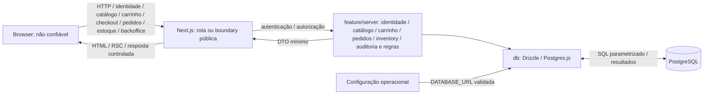

# Threat model e trust boundaries

Guardian Bay é um e-commerce de simulação. Este modelo reflete a revisão da Epic 9 e aplica as [decisões arquiteturais aprovadas](README.md#decisões-arquiteturais-essenciais), sem antecipar funcionalidades de domínio.

## Escopo e estado atual

Hoje existem páginas Server `/`, `/login`, `/register`, `/account`, `/products`, `/products/[id]`, `/admin`, `/admin/catalog`, `/admin/orders`, `/admin/orders/[id]`, `/admin/audit`, `/cart`, `/checkout`, `/orders` e `/orders/[id]`, formulários/botão de logout Client mínimos, assets públicos, baseline HTTP e infraestrutura lazy PostgreSQL/Drizzle protegida por `server-only`. Há schemas/migrations `users`, `sessions`, `login_rate_limits`, `categories`, `products`, `cart_items`, `orders`, `order_items`, `inventory`, `audit_events` e `abuse_budgets`, credenciais Argon2id e sessões revogáveis. Cinco Actions implementam identidade/acesso; uma Action administrativa implementa criação/edição de categorias e produtos e publicação/despublicação. Layout resolve sessão no servidor; conta devolve somente e-mail próprio. Integração usa PostgreSQL isolado e fluxos reais são testados em Next/Chromium HTTPS local. Catálogo público restringe publicação no SQL; preço é inteiro BRL/Dinero e ilustrações são Lucide por allowlist. Administração exige sessão e role admin atuais, com default customer e provisionamento operacional. Três Actions de carrinho autenticado persistem intenções por dono; preço/subtotal/total são derivados server-side do catálogo atual. Checkout acrescenta uma Action autenticada (`checkoutAction`), snapshot persistido, confirmação idempotente e pagamento simulado server-side; histórico/detalhes são leituras privadas. Uma Action administrativa de estoque define quantidade absoluta/revisão; catálogo público projeta inStock, carrinho distingue publicação de suficiência e PAID consome unidades atomicamente. Backoffice compõe catálogo/estoque e leitura administrativa de pedidos com admin atual na própria operação; pedidos permanecem read-only. Auditoria selecionada é durável e read-only para admin atual; budgets por usuário/operação limitam novas intenções comerciais e mutations administrativas. Não há Route Handler ou recuperação self-service.

Logística, reserva de estoque e pagamento real não são funcionalidades implementadas. Checkout, pedido e snapshot comercial existem com pagamento exclusivamente acadêmico. Não há integração financeira real. Bibliotecas citadas na stack que ainda não constam de `package.json` não são controles existentes. Deployment, domínio, terminação TLS e permissões reais de banco ainda não estão definidos; precisam de revisão quando houver ambiente concreto.

## Atores e ativos

| Ator | Capacidade e confiança |
| --- | --- |
| Visitante | Acessa a superfície HTTP atual; controla requests, URLs, headers e seu browser |
| Usuário autenticado | Identidade resolvida por sessão server-side; autenticação não torna seus inputs confiáveis nem autoriza recursos de outro usuário |
| Admin do backoffice | Capacidade atual verificada no PostgreSQL; pode alterar todo o catálogo e definir estoque, mas seus inputs continuam não confiáveis. Pode consultar snapshots de pedidos de qualquer dono somente pelas leituras administrativas autorizadas, sem identidade do comprador ou checkoutKey; pode consultar auditoria mínima por leitura própria autorizada, sem escolher/escrever eventos; não pode editar pedidos, recuperar senhas ou gerir usuários. Compras próprias continuam usando ownership normal da sessão |
| Atacante anônimo ou autenticado | Pode chamar entradas diretamente, trocar IDs/valores, repetir ou paralelizar requests e automatizar operações |
| Site externo malicioso | Pode induzir navegação ou requests do browser da vítima; relevante para XSS/CSRF quando houver conteúdo externo ou sessão |
| Desenvolvedor/operador | Controla código, dependências, configuração e CLI com privilégios operacionais; esses acessos não são concedidos ao browser. Provisiona admin do catálogo por transação operacional controlada e revoga sessões; não existe concessão pública de privilégio |

Ativos atuais: integridade do código/configuração e dos artefatos de build, credenciais de conexão quando configuradas, identidade/e-mail, hashes de senha, tokens/sessões, roles, integridade de produtos/categorias/preços/publicação e disponibilidade do servidor/pool. Carrinho adiciona ownership dos itens, quantity limitada e preço/subtotal/total derivados. Pedido acrescenta snapshot comercial, totais congelados, chave de intenção por dono, status de pagamento simulado e histórico privado. Inventory acrescenta quantidade disponível e revisão, incluindo risco de overselling/lost update. Backoffice acrescenta confidencialidade dos snapshots administrativos, integridade de filtros/revisões e role atual. Audit acrescenta integridade de eventos históricos selecionados e confidencialidade de actor/target UUIDs; budgets acrescentam integridade de contagem/janela e disponibilidade das operações. Ativos dos futuros fluxos: demais dados pessoais, descontos, reservas e dados de pagamento real. Logs e respostas devem preservar a confidencialidade desses ativos.

## Superfícies e fluxos

Entradas atuais: requests das páginas/formulários, assets e framework; argumentos das cinco Actions de identidade/acesso, da Action administrativa do catálogo e das três Actions autenticadas do carrinho (`addToCartAction`, `updateCartItemAction`, `removeCartItemAction`), com productId e quantity quando necessário; setInventoryQuantityAction recebe productId, quantity e revision como intenção administrativa; checkoutAction recebe apenas checkoutKey UUID; UUID de pedido e paginação privada limitada; rotas administrativas, UUID exato/status/sort/paginação de pedidos, evento/outcome/actor UUID/target UUID/sort/paginação de auditoria e nome/categoria/publicação do catálogo, sempre validados; UUID de produto e filtros/sort/paginação públicos; cookies de sessão; variáveis/arquivos privados e configuração da CLI Drizzle. Instalação depende de pacotes externos e o build baixa fontes. Entradas futuras de domínio: formulários, argumentos de Actions e bodies de handlers necessários, incluindo IDs e quantidades conforme a operação real.

`params`, `searchParams`, JSON, `FormData`, headers, cookies, hidden inputs, `.bind()`, localStorage e estado de UI são não confiáveis. Um token/cookie só fornece identidade após verificação server-side. Dados persistidos originados do cliente continuam não confiáveis para renderização e regras, mesmo após uma query válida.

O diagrama inclui persistência real de identidade/credenciais/sessão, catálogo, carrinho, pedidos, inventory, audit e budgets. A CLI carrega sua configuração separadamente das features. Leituras de navegação/conta/carrinho/checkout/pedidos seguem `Server Component → feature/server → db`; Actions seguem `Client → Action → feature/server → db`. Render não executa mutations, e dados de conta/carrinho/checkout/pedidos não usam cache compartilhado. Backoffice segue o mesmo fluxo Server-first; layout é guard de UX e não substitui autorização dentro da feature.

## Trust boundaries e autoridade

| Boundary / estado | O que atravessa e lado não confiável | Validação e autenticação/autorização exigidas nos consumidores | Autoridade e responsabilidade |
| --- | --- | --- | --- |
| Browser → Next.js — existente | URL, método, headers, cookies e, quando houver consumidor, payload; todo input externo é não confiável | A entrada server deve validar formato, tamanho e campos permitidos quando houver consumidor. Identidade e permissões são exigidas conforme o recurso/operação, não para todo asset público | Servidor define o acesso e os valores críticos; frontend fornece apenas intenção e feedback de UX |
| Client → Action — identidade/acesso, catálogo, carrinho, checkout e estoque existentes; Route Handler futuro | Argumentos/body e IDs, inclusive valores recebidos em props ou `.bind()`; caller é não confiável | Validação server-side: cadastro valida política de criação e limita hashing antes do INSERT único, sem autenticação automática ou confirmação de duplicidade; login valida contrato/credencial e origem; logout valida origem e revoga o token apresentado; leitura autorizada valida input/origem e exige autenticação, ownership e sessão válida na query; alteração de senha exige origem/contrato, resolve dono pela sessão, confirma senha atual e revalida estado/expiração na transação, sem ID de autoridade do cliente. Gerenciamento valida contrato estrito, mesma origem e admin persistido dentro da transação; projeta campos permitidos e usa revisão no UPDATE. Carrinho exige mesma origem e contrato estrito, deriva ownership da sessão e nunca aceita preço/total como autoridade; relê produto/publicabilidade quando necessário, limita quantidade a 1–99 e ao estoque atual sem reserva, e revalida sessão após espera relevante na operação. Checkout valida somente chave estrita por dono, mesma origem e sessão; relê carrinho/produtos/inventory sob locks ordenados, deriva snapshot e status no servidor e revalida sessão após espera. Estoque administrativo exige mesma origem, admin atual e contrato estrito/revisão; Client não fornece autoridade de estoque. Checkout novo e catálogo/estoque administrativos consomem budget do dono server-side após contrato/autorização; retry de pedido existente precede budget/audit. Operações concluídas selecionadas gravam audit fechado junto ao efeito, sem payload ou actor externo. Backoffice reutiliza as mesmas Actions de catálogo/estoque; pedidos administrativos não têm mutation. AlertDialog não concede autorização. Operações futuras verificam sessão, autorização, ownership e estado atual na execução | `feature/server` resolve identidade/sessão; nas operações de domínio decide valores críticos. Página/Proxy/UI não concedem autoridade |
| Next.js/CLI → PostgreSQL — identidade/sessão/catálogo/carrinho/pedidos/inventory/audit/budgets implementados | Credencial de conexão, queries e resultados cruzam processos; SQL pode carregar valores originados do cliente | Queries parametrizadas, constraints/FK, UPSERT atômico de budget e locks. Troca de hash/revogação de sessões é transacional; criação de sessão rejeita hash verificado obsoleto. Catálogo aplica publicação nas queries públicas, FK/constraints de preço/imagem e locks de identidade/sessão na administração, com revalidação de expiração e revisão concorrente. Carrinho usa `cart_items` com PK usuário/produto, FKs e CHECK de quantidade; queries escopadas pelo usuário derivado da sessão, UPSERT/locks nas mutations e produto/preço relidos do catálogo. Pedidos usam UNIQUE por usuário/key, snapshot com CHECKs, bigint limitado e transação única para pagamento acadêmico/remoção dos itens convertidos. Inventory tem PK/FK RESTRICT, CHECK de quantidade/revisão e backfill zero; checkout adquire locks ordenados, relê estoque, decrementa condicionado apenas em PAID e incrementa revisão; admin usa revisão otimista. Audit tem UUID/data/tipo/outcome/actor/target/correlation e CHECKs fechados, sem payload/FK destrutiva; writer só recebe evento selecionado interno. Budget autenticado usa PK usuário/operação e UPSERT com cap/janela; savepoint desfaz efeito/audit e confirma reserva na mesma conexão. Leituras administrativas de pedidos/auditoria verificam admin atual, revalidam sessão após espera e usam queries parametrizadas/paginação limitada | Feature decide regras/DTO; `db` executa persistência; PostgreSQL preserva integridade configurada, sem inferir ownership do usuário a partir da credencial compartilhada |
| Servidor → browser — DTOs de identidade/catálogo/carrinho/pedidos/estoque/auditoria existentes | HTML/RSC, props, assets, retornos e cookie de sessão | Feature projeta DTO mínimo; leitura pública não transporta revisão/estado administrativo, e somente admin recebe os campos necessários à edição; token bruto é entregue somente pelo Set-Cookie protegido, não pelo retorno da Action. DTO do carrinho não expõe userId, cartId, revision, sessão ou estrutura Drizzle; preço/subtotal/total são derivados no servidor. Pedido projeta snapshot histórico mínimo, sem dono, checkoutKey ou estrutura Drizzle; detalhes consultam id e dono na mesma query. Catálogo expõe somente inStock; carrinho distingue stockSufficient; revisão de inventory fica somente no DTO administrativo autorizado. Pedido administrativo expõe somente id/data/status/total e itens snapshot necessários; não inclui comprador, userId, checkoutKey, sessão ou rows completas. Auditoria projeta somente eventId/data/eventType/outcome/actor UUID/target, sem correlationId, payload ou identidade pessoal; counters/bucket keys não saem em RATE_LIMITED. Conteúdo externo exige tratamento adequado ao contexto de renderização | Hashes, registro interno de sessão, entidades completas e erros brutos não saem. Dados devolvidos e reenviados pelo browser voltam a ser input não confiável |
| Ambiente/ferramentas externas → servidor, CLI e build — existente | `DATABASE_URL`, pacotes e fontes; privilégio operacional não equivale a dados seguros por origem | Infraestrutura valida configuração antes do uso; instalação usa lockfile e dependências exigem revisão. Origem, acesso a secrets e segurança do transporte são responsabilidades operacionais | Browser não seleciona credenciais/destino do DB. Build/CLI possuem privilégios próprios; produção exige isolamento e revisão de acesso/transporte |

`app → feature/server → db` também é um limite arquitetural interno, não uma autenticação entre processos. `server-only` protege imports client, mas não autoriza uma chamada. A CLI é uma entrada operacional privilegiada separada dos endpoints e deve usar o banco correto; não depende de autorização da UI.

## Ameaças prioritárias

Recuperação self-service não é uma superfície existente. Perda de acesso requer contato administrativo externo, ainda sem operação privilegiada de recuperação na aplicação; admin do catálogo não concede essa capacidade. Futura substituição administrativa de credencial exige autenticação forte, autorização, auditoria e revogação de sessões; conhecer o e-mail não é prova de identidade. Consulte a [política de recuperação](README.md#recuperação-administrativa-ecmsg-38).

Usamos [STRIDE](https://learn.microsoft.com/en-us/azure/security/develop/threat-modeling-tool-threats) como classificação: **S** identidade falsa, **T** adulteração, **R** repúdio, **I** exposição de informação, **D** indisponibilidade e **E** elevação de privilégio. A classificação abaixo vale para o escopo atual; controles parciais não equivalem a eliminação da ameaça. Superfícies futuras devem ser reavaliadas quando implementadas.

| Ameaça / STRIDE | Estado | Controle e risco residual |
| --- | --- | --- |
| Sessão/autenticação — S/E | Parcialmente mitigada | Argon2id, contratos distintos, hash sintético para usuário ausente, token aleatório, hash persistido, rotação, idle/limite absoluto e revogação reais; troca de senha exige credencial atual e revoga todas as sessões. Cadastro duplicado não muda senha nem autentica; e-mail cadastrado não comprova posse. Cookie HttpOnly/Secure em produção. Token roubado continua bearer; não há MFA ou garantia de tempo constante absoluto |
| Autorização/IDOR/BOLA — E/I/T | Mitigada nos recursos atuais | Deny by default, identidade mínima e ownership/sessão na query da própria identidade; PostgreSQL testa A→A, A→B e revogação entre checks. Administração verifica role atual, sessão e estado dentro da operação; cadastro/payload não concedem admin. UUID trocado não concede acesso a visitante/customer. Carrinho deriva dono da sessão e escopa read/mutations pelo usuário; trocar productId não permite operar item de outro dono. Histórico lista somente pedidos próprios; detalhe combina orderId e usuário/sessão na query, com apresentação equivalente para pedido alheio e inexistente. Checkout deriva dono da sessão e rejeita userId externo; estoque administrativo exige role atual, nunca ownership de produto concedido pelo UUID. Backoffice nega visitante/customer; listagem/detalhe administrativos verificam admin atual na própria leitura, inclusive role removida/expiração durante espera. Auditoria exige admin atual dentro da leitura/revalidação; UUID fornecido não concede acesso ou capacidade de escrever evento. Layout não concede acesso por si só |
| Valores críticos — T | Mitigada no catálogo, carrinho, pedidos e estoque atuais | Preço inteiro positivo em centavos BRL, constraints PostgreSQL e contrato Dinero seguro; edição exige admin e projeção de campos. Float/moeda/autoridade extra são rejeitados. Carrinho relê preço do catálogo e calcula subtotal/total no servidor, sem persistir esses valores ou conferir autoridade monetária ao Client. Preço exibido ou reenviado pelo Client não autoriza compra; pedido congela snapshot e status simulado no servidor; estoque atual é relido e consumido server-side, quantidade nunca negativa por UPDATE condicionado/CHECK; pagamento real não implementado |
| Entrada maliciosa — T/D | Mitigada nas Actions atuais | Schemas strict com limites e argumentos extras rejeitados antes de custo; body de 16 KiB testado no transporte real. Filtros administrativos usam Zod, status/sort allowlisted, UUID exato, páginas/limites e nome limitados; sort não determina identificador SQL. Tamanho/taxa do tráfego geral exige entrada confiável |
| XSS/browser — T/I/E | Parcialmente mitigada | Nome/descrição/categoria/alt são plain text escapado pelo React, sem HTML rico ou sink inseguro; imagens aceitam somente chave de ícone Lucide, sem paths/URLs do cliente. CSP bloqueia objetos/frames/mídia/workers e restringe imagens/fontes, mas não scripts/styles. Teste Chromium verifica runtime e bloqueios reais; Trusted Types não está habilitado |
| CSRF — S/T | Mitigada nas Actions atuais | POST nativo, Origin/Host explícito, HTTPS Origin em produção e SameSite=Lax; forwarded não concede autoridade. Requests cross-origin/sem Origin são rejeitados. Novos handlers exigem análise própria; CORS não autoriza mutations |
| SQL Injection — T/I/E | Mitigada no código atual | Queries Drizzle e tags sql/Postgres.js parametrizadas; sem sql.raw ou identificadores fornecidos pelo cliente. Scanner triado manualmente, com constraints e queries reais |
| Exposição de informação — I | Mitigada nas saídas atuais | DTO explícito id/email na leitura autorizada e somente e-mail na conta, hash/token fora do retorno, erros genéricos e logger allowlist; produtos privados/inexistentes recebem apresentação equivalente, e publicação/preço são relidos por request sem cache persistente; leitura privada não é cached e testes HTTP/DB conferem isolamento. DTO do carrinho é mínimo, sem IDs internos de ownership ou dados de sessão. Revisão de inventory somente em contexto administrativo autorizado; disponibilidade pública é inStock. DTO administrativo de pedido permanece mínimo, sem comprador/userId/checkoutKey/sessão; histórico privado normal mantém ownership. Auditoria não recebe secrets, SQL/stack, checkoutKey, snapshot ou PII; IDs mínimos históricos têm retenção operacional explícita. Logs de terceiros exigem revisão operacional |
| Abuso, brute force, credential stuffing e DoS — D/S | Parcialmente mitigada | Budgets atômicos por identificador/global e dois slots protegem Argon2; expiração não bloqueia conta permanentemente. Budgets autenticados limitam checkout novo/catálogo/estoque por usuário e operação, sem IP controlado pelo cliente ou cap global indiscriminado; limites concorrentes e janelas são testados. Limiares são auditados sem registro por bloqueio banal. Sem IP confiável, atacante pode esgotar o budget global de autenticação. Proteção volumétrica/de origem depende do contrato de entrada ECMSG-27 antes de exposição pública |
| Concorrência/replay — T/D | Mitigada nas operações atuais | Reservas/slots atômicos; login rotaciona, logout idempotente revoga no servidor e replay revogado não autentica. Query protegida revalida sessão/ownership; troca de credencial/revogação é atômica e login com hash obsoleto não cria sessão após a troca. Edição do catálogo usa revisão e locks na autorização; testes comprovam rollback por expiração e negação por revogação concorrente. Carrinho usa UPSERT no add e serializa update/remove pelo usuário, com sessão revalidada após espera relevante e races de despublicação cobertas. Checkout possui idempotência persistente por (userId, checkoutKey), protegendo double submit/retry; locks com carrinho e catálogo, snapshot e pagamento simulado na transação, remoção seletiva do carrinho e revalidação de sessão após esperas relevantes. Inventory ordenado sob UPDATE impede overselling; PAID consome na mesma transação e incrementa revisão, PAYMENT_FAILED/retry não consomem novamente; revisão administrativa impede lost update com checkout. Backoffice mantém expected revision em catálogo/estoque; conflito exige recarregar e não há retry automático stale. Leituras administrativas revalidam sessão após locks de identidade/sessão. Retry de pedido existente não gasta budget nem duplica audit; UPSERT preserva cap sob concorrência. Reserva de estoque permanece futura |
| Repúdio — R | Parcialmente mitigada | Audit durável selecionado de login/senha/revogação agregada/admin/pedido, fechado e atômico com efeitos críticos; consulta read-only admin e UUIDs históricos sem cascades. Logging diagnóstico continua best effort e não durável. Limiares anônimos são best effort; não há trilha completa/WORM contra operador do DB. Retenção de audit por manutenção manual limitada, sem scheduler/coletor externo |
| Configuração/build/transporte — S/T/I | Parcialmente mitigada; deployment pendente | Secrets server-only, template vazio, lockfile e migrations revisados; produção não definida. Quatro advisories moderados de tooling dev e peer opcional foram triados na revisão; HTTPS/TLS/privilégios/coletor precisam de validação operacional |

## Controles atuais e pendências

Controles observáveis: guards `server-only` em DB/configuração/credenciais/sessão/autorização, cadastro com resposta equivalente e INSERT único, troca de senha atual/transação/revogação, formulários mínimos RHF/Zod, conta própria sem ID do cliente, Argon2id e contratos distintos de criação/login, resposta equivalente e hash sintético para falhas de login, sessão revogável com expiração absoluta/idle, cookie HttpOnly/Secure em produção e validação de Origin/Host nas Actions; leitura da própria identidade com deny by default e ownership/sessão revalidados na query; body de Actions limitado a 16 KiB, reservas atômicas globais/por identificador e dois slots de hashing compartilhados, com eventos mínimos sem secrets; configuração privada validada, pool lazy, `.env*` ignorado com exceção do template, CSP incremental e gates de lint/tipos/unitários/build, integração PostgreSQL isolada e suíte HTTP/Chromium de segurança. Catálogo agrega publicação no SQL, preço seguro, admin atual, contratos estritos, revisão concorrente e imagens Lucide por allowlist. Carrinho acrescenta ownership derivado da sessão, quantity limitada a 1–99, até 100 produtos distintos, PK usuário/produto, preço relido do catálogo, cálculo server-side e concorrência protegida por locks/UPSERT; produto despublicado permanece visível como indisponível e fora do total. Pedido acrescenta snapshot server-side imutável na aplicação, chave idempotente por dono, histórico privado e transação única com pagamento simulado e limpeza dos itens convertidos. Inventory inicia zero, falta de linha falha fechado, carrinho não reserva nem remove item insuficiente, e PAID consome condicionado dentro da transação; revisão protege admin × checkout. Backoffice compõe features existentes; Orders administrativo é read-only, com filtros limitados, DTO mínimo e autorização independente do shell. Confirmação Radix é somente UX. Auditoria acrescenta writer fechado, evento obrigatório na transaction e consulta read-only admin; budgets autenticados são atômicos por dono/operação e retry existente não duplica capacidade/evento. Retenção manual é distinta de expiry dos buckets. Guest cart/checkout, reserva e pagamento real não existem. Consulte a [revisão do carrinho](README.md#revisão-da-epic-5-ecmsg-65) e a [revisão do catálogo](README.md#revisão-da-epic-4-ecmsg-53). Consulte [requests/abuso](README.md#boundaries-e-requests-ecmsg-26), [autenticação](README.md#autenticação-e-sessões-ecmsg-24), [autorização](README.md#autorização-server-side-ecmsg-25), [erros](README.md#tratamento-de-erros-e-observabilidade-ecmsg-17) e [testes](README.md#testes-ecmsg-19) para os limites.

Candidatos para próximas Tasks, vinculados às ameaças acima:

- Autenticação e sessão: revisar a política de rotação, CSRF e limites de abuso ao introduzir novas mutations ou mudança de privilégio.
- Autorização e ownership: aplicar o [padrão implementado na identidade](README.md#autorização-server-side-ecmsg-25) às futuras operações comerciais, com permissão/ownership por operação e testes IDOR/BOLA.
- Contratos de entrada/saída e conteúdo: validação, DTOs, erros/logs/cache seguro e tratamento de XSS; avaliar CSP mais restritiva nas páginas reais.
- Proteção contra abuso: [limites de login/requests implementados](README.md#boundaries-e-requests-ecmsg-26); definir origem/IP confiável e proteção de entrada no deployment antes da exposição pública, preservando o budget de hashing compartilhado.
- Integridade comercial futura: preservar snapshot de pedido ao introduzir reserva, logística e pagamento real; catálogo já usa centavos/BRL, constraints e revisão de edição; carrinho já relê preço e calcula subtotal/total server-side, sem snapshot comercial.
- Operação segura: revisar acesso a configuração/dependências, transporte HTTPS/TLS e privilégios do DB/CLI quando houver deployment; operacionalizar retenção manual de auditoria/buckets e configurar coleta/retenção dos logs mínimos e revisar os findings de tooling registrados na [revisão da Epic 4](README.md#revisão-da-epic-4-ecmsg-53).

Essas pendências não atribuem IDs nem autorizam implementação antecipada. Reavalie o modelo ao alterar sessão, tabela, entrada pública ou integração externa, registrando sua boundary, autoridade, ameaça e evidência de mitigação. [Security-review](../../.agents/skills/security-review/SKILL.md) faz a revisão contextual; scanners são complementares.

## Carrinho: revisão da Epic 5 (ECMSG-54–65)

Registro histórico do escopo da Epic 5: as referências abaixo a estoque/pedido/checkout futuros valem para aquela base, anterior à Epic 6. Os controles atuais de pedidos estão nas seções globais e na revisão da Epic 6.

Carrinho agora é ativo real: itens por usuário autenticado em `cart_items`, quantity 1–99, máximo transacional de 100 produtos e preço atual derivado. Entradas: três Actions add/update/remove com productId e, quando necessário, quantity; `/cart` é leitura Server, sem identificador de dono externo. Fluxo: Client → Action com Origin/contrato → cart/server com sessão/ownership → DB; read projeta DTO mínimo e Dinero deriva subtotais/total de produtos atuais. Não há APIs de estoque/checkout/pagamento ou guest cart.

| Ameaça | Estado | Controle/evidência e limite |
| --- | --- | --- |
| IDOR/BOLA e ownership forjado | Mitigada nesta surface | Sessão fornece userId; toda query/mutation restringe esse dono. PostgreSQL e HTTP provam isolamento A/B, mesmo productId existente e chamada direta |
| Manipulação monetária / mass assignment | Mitigada | Zod strict rejeita price/amount/unitPrice/currency/subtotal/total/role/revision/ownerId extras; preço atual vem do join catálogo, centavos/BRL/Dinero e limites garantem representação segura. Carrinho não congela preço |
| Quantidade e amplificação de itens | Parcialmente mitigada | Schema e CHECK 1–99, PK única e até 100 produtos sob lock por usuário. Não garante disponibilidade sob tráfego volumétrico; entrada confiável continua pendente |
| SQL Injection | Mitigada no caminho atual | Drizzle/tags parametrizadas, UUID estrito, sem SQL raw ou identificador externo. Scanner SQL triado contextual e casos malformados reais |
| CSRF / Origin / body | Mitigada nas três Actions | Same-origin explícito, HTTPS Origin em produção, SameSite e body 16 KiB do framework; HTTP real testa origem forjada/ausente, headers e excesso de body |
| Concorrência, replay e catálogo alterado | Mitigada no escopo atual | User/session locks, UPSERT limitado e SHARE de produto, revalidação após espera. Add repetido incrementa até limite; update absoluto e remove idempotente. Preço novo é relido; item retirado não some e não participa do total |
| Sessão revogada/expirada durante locks | Mitigada no ponto de autorização | Revogação serializa com sessão/identidade e impede chamada ainda não autorizada; relógio atual revalidado antes de concluir e rollback por expiração absoluta/idle em add/update/remove. Não desfaz efeito já autorizado antes de revogação posterior |
| Information disclosure / logs | Mitigada nas saídas atuais | DTO sem userId/cartId/revisão/registro Drizzle; erros inesperados sanitizados e propagados, UI controlada; logger só operation/event/result/timestamp/correlationId, sem payload, SQL, preço forjado ou secrets |
| XSS | Parcialmente mitigada | React escapa nome/ilustração, sem HTML rico; Chromium comprova nome malicioso tratado como texto. CSP continua parcial, sem restrição de scripts/styles |
| Repúdio e operação | Parcialmente mitigada / pendente | Falhas server-side allowlist são best effort; entrega durável, acesso/retenção de logs e deployment HTTPS/privilégios/entrada não implementados |
| Guest cart, estoque, snapshot comercial, pedido/pagamento | Não aplicável nesta Epic | Sem superfície implementada. Snapshot definitivo e integridade de compra devem ser modelados no futuro checkout/pedido |

Evidências e limitações operacionais estão na [revisão da Epic 5](README.md#revisão-da-epic-5-ecmsg-65). Compatibilidade da assertion herdada RESTRICT com PostgreSQL anterior ao 18 e os quatro advisories moderados de tooling são pendências, não novas regras comerciais. Nenhum scanner substitui ownership/autorização ou permite exposição pública sem resolver a proteção de entrada.

## Pedido/checkout: revisão da Epic 6 (ECMSG-66–78)

Registro histórico anterior à Epic 7: estoque ausente nesta base. Os controles atuais de inventory estão nas seções globais e na revisão da Epic 7.

Ativos/entradas reais: orders/order_items, snapshot comercial, checkoutKey por dono, pagamento acadêmico, `/checkout`, `/orders`, `/orders/[id]` e checkoutAction. Client fornece somente intenção UUID; servidor resolve sessão, carrinho próprio e produto/preço atuais e decide valores/status. Histórico consulta snapshot, sem depender de produto atual. Nenhum dado financeiro é coletado.

| Ameaça | Estado | Controle/evidência e limite |
| --- | --- | --- |
| Ownership / IDOR / BOLA | Mitigada no escopo atual | Sessão fornece dono; detalhe combina pedido + dono na query, histórico é privado e limitado. IDs alheios/inexistentes têm resposta equivalente; testes A/B reais |
| Manipulação de preço/snapshot/status e mass assignment | Mitigada | Zod strict aceita somente checkoutKey; centavos BRL/Dinero e CHECKs/bigint limitado preservam precisão. Produto/nome/preço relidos sob SHARE, snapshot não muda depois; estado somente pending → paid/failed server-side |
| Double submit / replay / idempotência | Mitigada por intenção | UNIQUE(userId,checkoutKey) e serialização por dono; retry retorna pedido original antes de tocar carrinho. Chave não autoriza e usuários são independentes. Nova chave é nova intenção; não promete exactly-once entre intenções |
| Races checkout × carrinho/catálogo | Mitigada no caminho atual | Locks identidade/sessão/itens/produtos em ordem estável, revalidação após espera. Produto editado primeiro é relido; edição posterior espera. Snapshot, pagamento e remoção seletiva são atômicos; adição posterior e replay antigo preservam itens novos |
| Sessão expirada/revogada | Mitigada no ponto de autorização | PostgreSQL real comprova rollback por idle/absoluta durante lock e negação por revogação antes de autorização. Não cancela efeitos já commitados antes de revogação posterior |
| CSRF / Origin / Host / body | Mitigada na Action atual | Mesma origem/Host explícitos, sem confiança em forwarded; body 16 KiB. HTTP real usa node:http para Host forjado e testa origem/body/contrato |
| SQLi / information disclosure | Mitigada no caminho atual | Tags/Drizzle parametrizados, UUID estrito, DTO sem owner/key/sessão, exception sanitizada sem cause e logger allowlist sem snapshot/SQL/secrets |
| XSS | Parcialmente mitigada | React escapa nome histórico; Chromium testa texto malicioso, hydration e CSP herdada. Scripts/styles continuam sem CSP rígida |
| Abuso / repúdio / operação | Parcialmente mitigada / pendente | Carrinho limitado e queries paginadas; coleta durável/retenção/entrada volumétrica/deployment/HTTPS e limpeza de sessões permanecem pendentes. Histórico comercial não é trilha de auditoria operacional |
| Estoque, reserva, frete, gateway/dados financeiros e guest checkout | Não aplicável | Nenhuma dessas superfícies foi implementada; pagamento acadêmico não movimenta dinheiro nem comprova pagamento real |

Evidências completas e limitações estão na [revisão da Epic 6](README.md#revisão-da-epic-6-ecmsg-78). Preservam-se token bearer roubado, e-mail não verificado, CSP parcial, tooling e PostgreSQL 18 para reproduzir todos os gates atuais; PostgreSQL 17 mantém FK RESTRICT, mas retorna 23503 em vez do 23001 esperado pela assertion herdada. Nenhum finding é corrigido automaticamente e a validação local não autoriza exposição pública.

## Estoque: revisão da Epic 7 (ECMSG-79–91)

Inventory é ativo atual, separado do catálogo: productId PK/FK RESTRICT, quantidade inteira não negativa e revisão. Produto existente recebe zero por migration e produto novo na transação administrativa. Catálogo projeta inStock sem esconder publicado sem estoque; carrinho permanece intenção sem reserva e mantém item insuficiente visível. Checkout aceita somente checkoutKey e relê catálogo/estoque sob locks ordenados, sem parcial.

| Ameaça | Estado | Controle/evidência e limite |
| --- | --- | --- |
| Overselling / estoque forjado — T | Mitigada no caminho atual | UPDATE lock ordenado de inventory, validação de todos os itens e decremento condicionado/CHECK na mesma transação de snapshot/PAID/limpeza. PostgreSQL real prova última unidade, múltiplos itens e pagamento recusado concorrente |
| Lost update admin × admin/checkout — T | Mitigada | Admin atual, contrato estrito, produto antes de inventory, optimistic revision no UPDATE; PAID incrementa revision. Ambos os vencedores da disputa são testados; revisão saturada falha fechado |
| IDOR/BOLA / mass assignment / CSRF — E/T | Mitigada nas surfaces atuais | Carrinho/pedido derivam dono da sessão; estoque exige role admin atual e mesma origem. Estoque/revisão forjados em carrinho/checkout e campos adicionais são rejeitados; HTTP real confere Origin/Host/body |
| Replay / expiração — T/D | Mitigada no ponto de autorização | Mesma intenção encontra pedido antes do estoque, sem novo consumo. Sessão revalidada após inventory wait, rollback por expiração; revogação anterior à autorização nega. Não desfaz efeito já autorizado antes de revogação posterior |
| SQLi / disclosure / XSS — I/T | Mitigada no caminho SQL/DTO; XSS parcial | Queries parametrizadas, erros sanitizados, logger allowlist; quantidade/revisão administrativa só ao admin. Texto escapado e Chromium real; CSP segue parcial |
| Disponibilidade / operação — D/R | Parcialmente mitigada / pendente | Carrinho limitado, sem reserva, locks proporcionais às linhas e queries limitadas. Entrada volumétrica, logs duráveis, deployment/TLS e limpeza de sessões continuam pendentes |
| Reserva, depósitos, ledger, logística, gateway real e guest checkout | Não aplicável | Nenhuma dessas superfícies existe; pagamento acadêmico não movimenta dinheiro |

Evidências: 106 unitários, 146 PostgreSQL 18, 10 HTTP/Chromium sem skips e sete mutantes rejeitados/restaurados. Ver [revisão da Epic 7](README.md#revisão-da-epic-7-ecmsg-91). Preservam-se riscos de token bearer, e-mail não verificado, quatro advisories moderados de tooling e compatibilidade da assertion RESTRICT no PostgreSQL 17; não há mudança de segurança para produzir gates verdes.

## Backoffice: revisão da Epic 8 (ECMSG-92–104)

Registro histórico daquela base: referências a ausência de auditoria durável abaixo precedem a Epic 9; consulte as seções globais para o estado atual.

Superfície atual: `/admin`, `/admin/catalog`, `/admin/orders` e detalhe administrativo. Auth continua autoridade de role/sessão, Catalog de preço/publicação, Inventory de quantidade/revisão e Orders de snapshot/status. Backoffice somente compõe; não possui regras comerciais paralelas nem mutation de pedido.

| Ameaça | Estado | Controle e limite |
| --- | --- | --- |
| Privilege escalation / role stale / IDOR-BOLA — E/I | Mitigada nas operações atuais | Cada leitura/Action exige admin atual; visitante/customer negados mesmo em chamada direta. Layout é somente UX; remoção de role e sessão expirada/revogada, inclusive durante lock, negam leitura |
| Mass assignment / CSRF — T/S | Mitigada nas mutations existentes | Actions reutilizadas com Zod strict, mesma origem e body limitado; UUID/revision/intenção não concedem role. HTTP testa Origin/Host e campos forjados |
| SQLi / filtros / abuso de consulta — T/D | Mitigada nas queries atuais; volumetria parcial | Parametrização, sort/status allowlisted, UUID exato, nome literal limitado, páginas 1–1.000 e pedidos 1–50 por página; proteção volumétrica operacional segue pendente |
| Disclosure / XSS — I/T | Disclosure mitigado; XSS parcialmente mitigada | DTO mínimo sem identidade do comprador, checkoutKey ou sessão; snapshot plain text escapado, erros/logs controlados e Chromium. CSP continua parcial |
| Lost update / replay — T | Mitigada nas operações atuais | Catálogo/estoque mantêm revisão e locks, inclusive checkout concorrente. UI não faz retry stale; confirmação de despublicação é somente UX |
| Edição indevida de pedido — T | Sem superfície administrativa de mutation | Pagamento síncrono acadêmico não exige intervenção; listagem/detalhe read-only usam snapshot persistido. Testes de contratos e POST demonstram preservação; não há mark-paid/refund/delete/edit |
| Repúdio / operação — R | Parcialmente mitigada | Eventos allowlisted best effort; sem auditoria durável. Token bearer, e-mail não verificado, HTTPS/deployment, limpeza de sessões e proteção volumétrica permanecem limitações |

Evidências: PostgreSQL real, Actions HTTP diretas e Chromium de login → dashboard → catálogo/estoque → pedidos/detalhe, confirmação/cancelamento acessível e negação ao customer. Seis mutantes temporários foram detectados e restaurados. Nenhuma migration nova; regras e persistência comerciais anteriores permanecem. Gestão completa de usuários, refund, logística, analytics e RBAC granular continuam fora do escopo. Preservam-se os quatro advisories moderados de tooling e a necessidade de PostgreSQL 18 para todos os gates; em PostgreSQL 17, RESTRICT funciona mas a assertion herdada recebe SQLSTATE diferente.

## Auditoria e abuso: revisão da Epic 9 (ECMSG-105–117)

Estado atual: eventos selecionados em audit_events, writer server-only strict com allowlists e consulta /admin/audit protegida dentro da feature. Actor deriva das autoridades de sessão/operação, targets são UUIDs históricos mínimos. Não há metadata/payload ou Action pública de escrita. Budgets autenticados por usuário/operação, janela/cap atômicos e sem IP/role externos; autenticação preserva budgets/slots anteriores.

| Ameaça | Estado | Controle e limite |
| --- | --- | --- |
| Tampering/privilege escalation — T/E | Mitigada nos caminhos atuais | Writer interno fechado, eventos derivados das operações reais e admin atual em leitura própria; nenhuma API de edit/delete/clear. Operador DB permanece privilegiado; não é WORM |
| Repúdio/atomicidade — R/T | Parcialmente mitigada | Login verificado, senha/revogação agregada, mutation admin e pedido final gravam junto ao efeito; falha faz rollback. Retry não duplica. Seleção não é histórico completo; threshold best effort pode perder evento |
| Disclosure — I | Mitigada nas saídas atuais | Sem secrets, Request/headers, payload, checkoutKey, snapshot, SQL/stack ou PII desnecessária; DTO mínimo sem correlationId. UUIDs históricos têm retenção operacional |
| Flood/abuso/concorrência — D | Parcialmente mitigada | Nenhum evento por request/filtro/404/bloqueio banal; limiar emite na passagem do cap. Budgets atômicos por usuário/operação, reserva persiste quando savepoint comercial volta atrás; sem segundo pool sob locks. Defesa volumétrica/deployment permanece pendente |
| Retry comercial — T/D | Mitigada | Dono/chave existente retornam antes de budget/append; intenção nova limitada, sem bypass por chave de outro usuário. PAID e PAYMENT_FAILED têm um evento final |
| Consulta/filtros — E/I/T/D | Mitigada nas queries atuais | Admin atual/revalidação, Zod strict, allowlists, UUID exato, sort mapeado e paginação limitada, SQL parametrizado; nenhuma mutation de leitura |
| Retenção/operação — R/D | Parcialmente mitigada | Audit 90 dias, buckets após expiry; manutenção manual limitada documentada/testada, sem scheduler. Privilégios, backups, monitoramento e execução efetiva são responsabilidades de deployment |

Evidências: 113 unitários, 172 PostgreSQL 18 e 12 HTTP/Chromium sem skips relevantes; seis mutantes detectados/restaurados. Zero/upgrade da Epic 8 têm migrations equivalentes e sem drift. Sem dependência nova; zero findings de produção e quatro advisories moderados herdados do tooling. Preservam-se CSP parcial, bearer roubado, e-mail não verificado, entrada volumétrica/HTTPS/deployment, logs não duráveis e limpeza de sessões. PostgreSQL 17 mantém FK RESTRICT, mas retorna SQLSTATE diferente na assertion herdada; PostgreSQL 18 reproduz todos os gates. Não há SIEM/event sourcing, reserva, gateway/pagamento financeiro real ou guest checkout.
